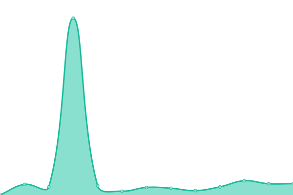

# [📈 Live Status](https://sredevopsdev.github.io/sredevops-upptime): <!--live status--> **🟩 All systems operational**

This repository contains the open-source uptime monitor and status page for [SREDevOps.cl](https://sredevops.cl), powered by [Upptime](https://github.com/upptime/upptime).

With [Upptime](https://upptime.js.org), you can get your own unlimited and free uptime monitor and status page, powered entirely by a GitHub repository. We use [Issues](https://github.com/sredevopsdev/sredevops-upptime/issues) as incident reports, [Actions](https://github.com/sredevopsdev/sredevops-upptime/actions) as uptime monitors, and [Pages](https://sredevopsdev.github.io/sredevops-upptime) for the status page.

<!--start: status pages-->
<!-- This summary is generated by Upptime (https://github.com/upptime/upptime) -->
<!-- Do not edit this manually, your changes will be overwritten -->
<!-- prettier-ignore -->
| URL | Status | History | Response Time | Uptime |
| --- | ------ | ------- | ------------- | ------ |
|  [SREDevOps.org](https://sredevops.org) | 🟩 Up | [sre-dev-ops-org.yml](https://github.com/sredevopsdev/sredevops-upptime/commits/HEAD/history/sre-dev-ops-org.yml) | 

 1029ms
     
 | 

<a href="https://status.sredevops.org/history/sre-dev-ops-org">68.47%</a>
    

|  [ElClaustro.cl](https://elclaustro.cl) | 🟩 Up | [el-claustro-cl.yml](https://github.com/sredevopsdev/sredevops-upptime/commits/HEAD/history/el-claustro-cl.yml) | 

 708ms
     
 | 

<a href="https://status.sredevops.org/history/el-claustro-cl">67.90%</a>
    

|  [SweetCaroline.cl](https://SweetCaroline.cl) | 🟩 Up | [sweet-caroline-cl.yml](https://github.com/sredevopsdev/sredevops-upptime/commits/HEAD/history/sweet-caroline-cl.yml) | 

 497ms
     
 | 

<a href="https://status.sredevops.org/history/sweet-caroline-cl">100.00%</a>
    

|  Redacted | 🟩 Up | [redacted.yml](https://github.com/sredevopsdev/sredevops-upptime/commits/HEAD/history/redacted.yml) | 

 495ms
     
 | 

<a href="https://status.sredevops.org/history/redacted">6.96%</a>
    

<!--end: status pages-->

[**Visit our status website →**](https://sredevopsdev.github.io/sredevops-upptime)

## 📄 License

- Powered by: [Upptime](https://github.com/upptime/upptime)
- Code: [MIT](./LICENSE) © [SREDevOps.cl](https://sredevops.cl)
- Data in the `./history` directory: [Open Database License](https://opendatacommons.org/licenses/odbl/1-0/)
