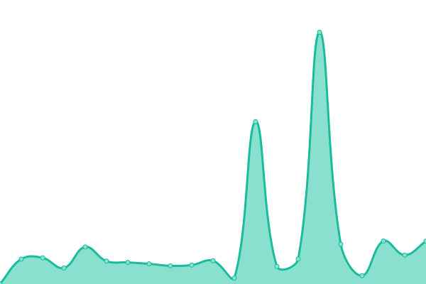
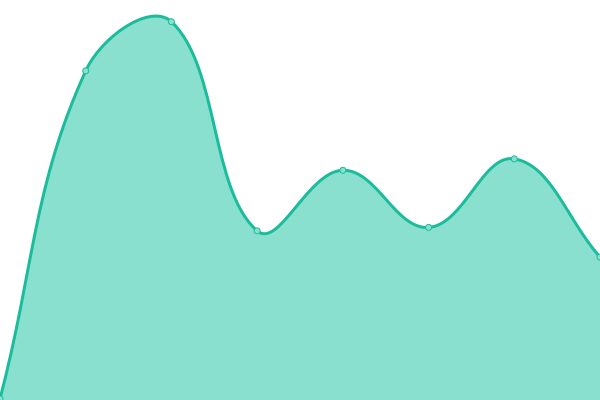
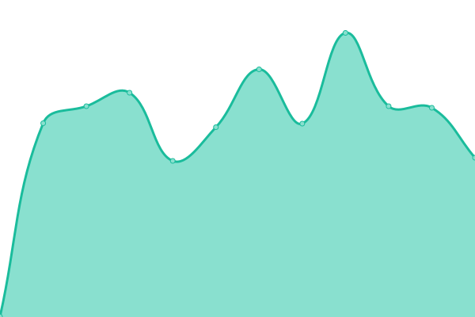

# [📈 Live Status](https://sredevopsdev.github.io/sredevops-upptime): <!--live status--> **🟩 All systems operational**

This repository contains the open-source uptime monitor and status page for [SREDevOps.cl](https://sredevops.cl), powered by [Upptime](https://github.com/upptime/upptime).

With [Upptime](https://upptime.js.org), you can get your own unlimited and free uptime monitor and status page, powered entirely by a GitHub repository. We use [Issues](https://github.com/sredevopsdev/sredevops-upptime/issues) as incident reports, [Actions](https://github.com/sredevopsdev/sredevops-upptime/actions) as uptime monitors, and [Pages](https://sredevopsdev.github.io/sredevops-upptime) for the status page.

<!--start: status pages-->
<!-- This summary is generated by Upptime (https://github.com/upptime/upptime) -->
<!-- Do not edit this manually, your changes will be overwritten -->
<!-- prettier-ignore -->
| URL | Status | History | Response Time | Uptime |
| --- | ------ | ------- | ------------- | ------ |
|  [SREDevOps.org](https://sredevops.org) | 🟩 Up | [sre-dev-ops-org.yml](https://github.com/sredevopsdev/sredevops-upptime/commits/HEAD/history/sre-dev-ops-org.yml) | 

 920ms
     
 | 

<a href="https://status.sredevops.org/history/sre-dev-ops-org">95.70%</a>
    

|  [ElClaustro.cl](https://elclaustro.cl) | 🟩 Up | [el-claustro-cl.yml](https://github.com/sredevopsdev/sredevops-upptime/commits/HEAD/history/el-claustro-cl.yml) | 

 2457ms
     
 | 

<a href="https://status.sredevops.org/history/el-claustro-cl">95.87%</a>
    

|  [SweetCaroline.cl](https://SweetCaroline.cl) | 🟩 Up | [sweet-caroline-cl.yml](https://github.com/sredevopsdev/sredevops-upptime/commits/HEAD/history/sweet-caroline-cl.yml) | 

 244ms
     
 | 

<a href="https://status.sredevops.org/history/sweet-caroline-cl">100.00%</a>
    

|  API k3s | 🟩 Up | [api-k3s.yml](https://github.com/sredevopsdev/sredevops-upptime/commits/HEAD/history/api-k3s.yml) | 

 532ms
     
 | 

<a href="https://status.sredevops.org/history/api-k3s">100.00%</a>
    

<!--end: status pages-->

[**Visit our status website →**](https://sredevopsdev.github.io/sredevops-upptime)

## 📄 License

- Powered by: [Upptime](https://github.com/upptime/upptime)
- Code: [MIT](./LICENSE) © [SREDevOps.cl](https://sredevops.cl)
- Data in the `./history` directory: [Open Database License](https://opendatacommons.org/licenses/odbl/1-0/)
