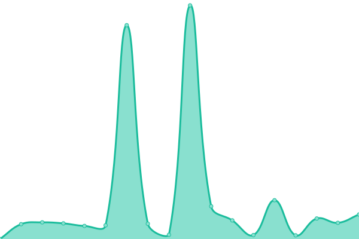

# [📈 Live Status](https://sredevopsdev.github.io/sredevops-upptime): <!--live status--> **🟧 Partial outage**

This repository contains the open-source uptime monitor and status page for [SREDevOps.cl](https://sredevops.cl), powered by [Upptime](https://github.com/upptime/upptime).

With [Upptime](https://upptime.js.org), you can get your own unlimited and free uptime monitor and status page, powered entirely by a GitHub repository. We use [Issues](https://github.com/sredevopsdev/sredevops-upptime/issues) as incident reports, [Actions](https://github.com/sredevopsdev/sredevops-upptime/actions) as uptime monitors, and [Pages](https://sredevopsdev.github.io/sredevops-upptime) for the status page.

<!--start: status pages-->
<!-- This summary is generated by Upptime (https://github.com/upptime/upptime) -->
<!-- Do not edit this manually, your changes will be overwritten -->
<!-- prettier-ignore -->
| URL | Status | History | Response Time | Uptime |
| --- | ------ | ------- | ------------- | ------ |
|  [SREDevOps.cl](https://SREDevOps.cl) | 🟥 Down | [sre-dev-ops-cl.yml](https://github.com/sredevopsdev/sredevops-upptime/commits/HEAD/history/sre-dev-ops-cl.yml) | 

 821ms
     
 | 

<a href="https://status.sredevops.cl/history/sre-dev-ops-cl">52.80%</a>
    

|  [ElClaustro.cl](https://ElClaustro.cl) | 🟥 Down | [el-claustro-cl.yml](https://github.com/sredevopsdev/sredevops-upptime/commits/HEAD/history/el-claustro-cl.yml) | 

 727ms
     
 | 

<a href="https://status.sredevops.cl/history/el-claustro-cl">53.05%</a>
    

|  [DarkCorp.cl](https://DarkCorp.cl) | 🟩 Up | [dark-corp-cl.yml](https://github.com/sredevopsdev/sredevops-upptime/commits/HEAD/history/dark-corp-cl.yml) | 

 1032ms
     
 | 

<a href="https://status.sredevops.cl/history/dark-corp-cl">100.00%</a>
    

|  [SweetCaroline.cl](https://SweetCaroline.cl) | 🟩 Up | [sweet-caroline-cl.yml](https://github.com/sredevopsdev/sredevops-upptime/commits/HEAD/history/sweet-caroline-cl.yml) | 

 213ms
     
 | 

<a href="https://status.sredevops.cl/history/sweet-caroline-cl">100.00%</a>
    

<!--end: status pages-->

[**Visit our status website →**](https://sredevopsdev.github.io/sredevops-upptime)

## 📄 License

- Powered by: [Upptime](https://github.com/upptime/upptime)
- Code: [MIT](./LICENSE) © [SREDevOps.cl](https://sredevops.cl)
- Data in the `./history` directory: [Open Database License](https://opendatacommons.org/licenses/odbl/1-0/)
